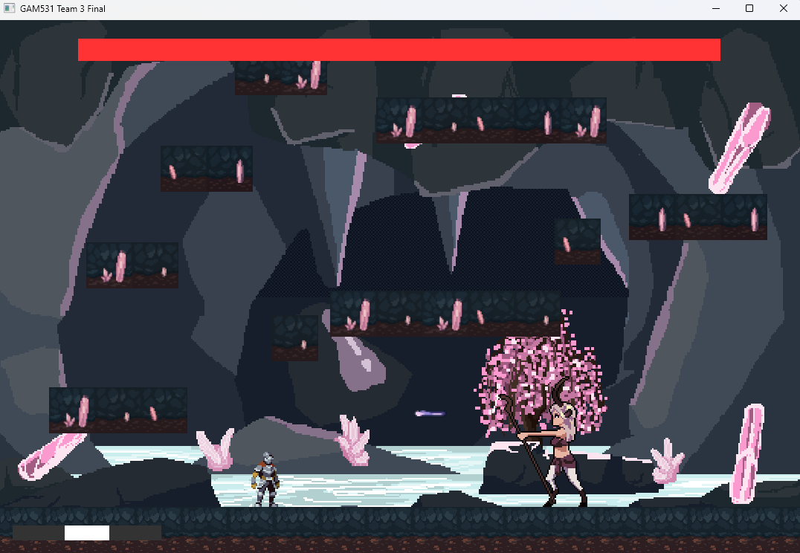

# GAM531 Final Project Team 3
---

The Shattering is a 2D Metroidvania game that allows players to explore, combat and gain powers through defeating enemies.

Created by: Marcos Ian Araujo Carneiro, Yuhan Zhao, Furqan Khurrum and Jackey Zhou

<p align="center">
  
</p>

## How to run
```bash
# Clone the repo
git clone https://github.com/Yuhan-Zhao-Aiden/GAM531_Team3_Final.git
cd GAM531_Team3_Final/

# Run
dotnet run
```
Or open in visual studio and click run button

## How to play
- Press ```A/D``` to move left/right
- Press ```Space``` or ```W``` or ```Up Arrow``` 
- Press ```J``` to attack
- Press ```K``` to roll


## Animations


<table>
<tr>
<td>

**Player**
- Idle
- Running
- Jumping
- Falling
- Attack
- Roll
- Death

</td>
<td>

**Enemy**
- Walk
- Attack
- Death
- Idle

</td>
</tr>
</table>


## Feature
- Simple gravity
- Collision detection and resolver
- Projectile collision
- 2D animation renderer (SpriteRenderer class)
- Enemy AI (Ranged attack)
- Health system
- UI element (player and enemy health bar)

## Animation State Machine
- State Machine is embedded in Player class contains animation switcher
- Animations are loaded from corresponding sprite sheets in the OnLoad function. 
- Player.PlayAnimation function checks for current active animation, prevents the same animation from restarting if it's already playing.
- the Player class has a FacingDirection property in the base class, default to right, it changes depending if the player press A/D, and it causes player sprite UV to flip, so that the animation plays with the character facing the correct direction
- Animation always plays full loop to prevent animation from getting stuck at intermediate frame.

## Challenges
- Cropping the correct part of the sprite was challenging, It was the reason my character disappear when i jump, because jumping animation sprites are incorrectly cropped, I used Microsoft Paint to get the exact coordinates of the sprites.
- All my Animation sprite sheets are facing one direction. i had to come up with a way to flip all the animation for the other direction. instead of manually flipping all the sprite sheets and load additional animation, I flipped UV coordinates of vertices instead. 

## Credits
- Character sprite: https://aamatniekss.itch.io/fantasy-knight-free-pixelart-animated-character
- Enemy sprite: https://craftpix.net/freebies/free-satyr-sprite-sheet-pixel-art-pack/
- ground tile: https://www.shutterstock.com/image-vector/pixel-art-tile-set-2d-retro-2323393295